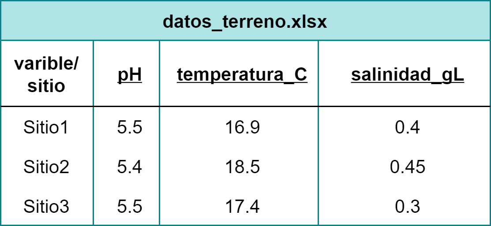
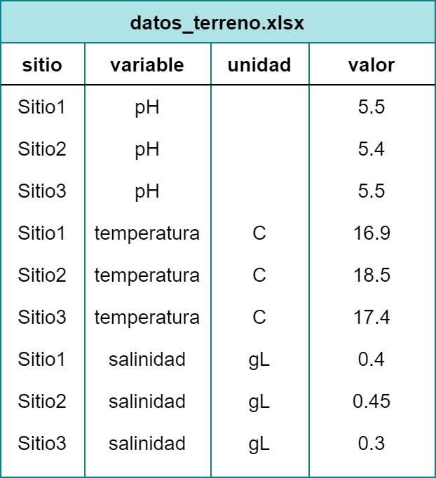

# ¿Qué veremos en la clase de hoy? `r emo::ji("pushpin")`

 - Aprenderemos las diferencias entre bases de datos en formato largo y ancho
 
--

 - Cuál es la utilidad y cuándo se justifica usar cada formato

--

 - Cómo pasar de un formato a otro usando funciones del paquete `tidyr`
 
---
# ¿Cómo están ordenados nuestros datos?


.pull-left[

### Formato ancho

Variables como nombres de columnas

Valores en casillas

```{r, echo =F, out.width="80%", fig.align='center'}

```

]

.pull-right[

### Formato largo

Nombres de variables dentro de una columna

Un valor por fila

```{r, echo = F, out.width="70%", fig.align='center'}

```

]
---
# `pivot_longer()` y `pivot_wider()`

.right-column2[
```{r, echo = F}
knitr::include_graphics("img/tidyr-longer-wider.gif")

```
.quote[
**Fuente:** Tidy Animated Verbs de Garrick Aden-Buie, modificado por Mara Averick
]
]

Las funciones `pivot_longer()` y `pivot_wider()` del paquete `tidyr` nos permiten transformar una planilla en formato ancho a una con formato largo y viceversa.

--

Ambas tienen un funcionamiento similar, así que comprendiendo bien una, podemos deducir el uso de la otra.

--

`r emo::ji("triangular_flag_on_post")`
**Debemos tener siempre claro dónde están nuestras variables y valores y dónde queremos que estos estén después de la transformación.**


---
class: center, middle

# ¡Vamos a ver cómo!
`r emo::ji("penguin")`


---
# ¡A practicar! `r emo::ji("test_tube")`

El argumento **`sep = "...."`** sirve cuando tenemos nombres con variables separadas por un caracter.

Rellena el siguiente código para obtener tres columnas a partir del nombre de las columnas seleccionadas.


```{r, eval = F}
library(datos)
library(tidyr)

pivot_longer(
  data = pinguinos,
  cols = largo_pico_mm:masa_corporal_g,
  names_to = _________, #<<
  ________ =  "valor", #<<
  names_sep = _______  #<<
)
```

---
# Respuesta


```{r, eval = T}
library(datos)
library(tidyr)

pivot_longer(
  data = pinguinos,
  cols = largo_pico_mm:masa_corporal_g,
  names_to = c("variable", "estructura", "unidad"),
  values_to = "valor",
  names_sep = "_"
)
```

---
# `pivot_wider()` `r emo::ji("bulb")`

Para usar `pivot_wider()` debemos pensar en la lógica inversa y utilizar **from** en vez de **to**.

La siguiente es una tabla que resume los promedios anuales para cada variable:

```{r, eval = T, message=F, echo = F}
library(tidyverse)
library(datos)

media_anual <- pinguinos %>% 
pivot_longer(
  cols = largo_pico_mm:masa_corporal_g,
  names_to = "variable",
  values_to = "valor"
) %>% 
  group_by(anio, variable) %>% 
  summarize(media = mean(valor, na.rm = T))
```

```{r, eval = F}
media_anual
```

```{r, echo=F}
print(media_anual, n = 5)
```

**¿Puedes inferir el resultado de la función?**

```{r, eval = F}
pivot_wider(media_anual, names_from = "anio", values_from = "media")
```

---
# Respuesta

```{r, eval = T}
pivot_wider(media_anual, names_from = "anio", values_from = "media")
```


---
class: middle, center
# ¡Gracias!
`r emo::ji("penguin")`