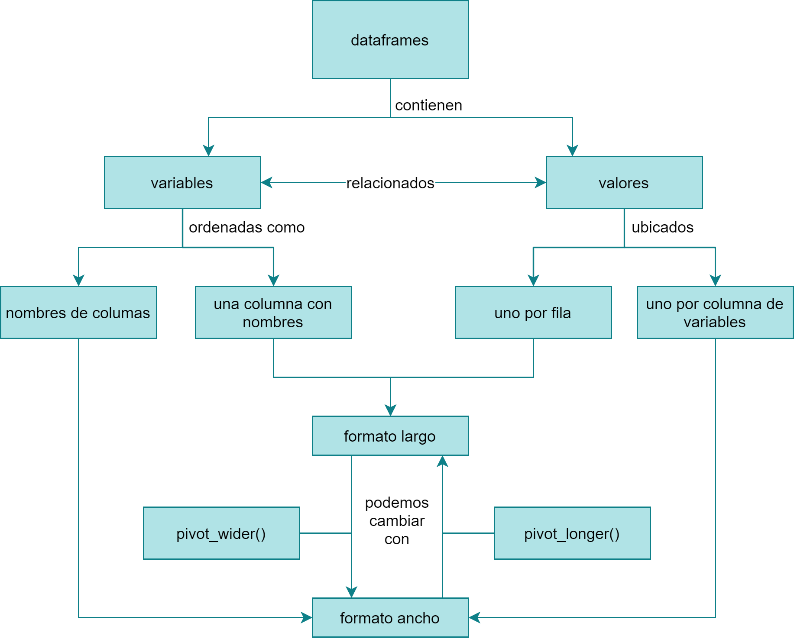

### Instructions for Sample Lesson

Prepare a 15-minute lesson on a topic related to R, RStudio products, or data science and submit it to the examiner at least two days before your scheduled examination. Your submission should include (but is not restricted to):

1.  A learner persona characterizing the audience for the lesson.
2.  A concept map showing the mental model you intend to convey.
3.  At least one formative assessment (such as a multiple choice question or Parsons Problem).
4.  Any notebooks or slides you would use to support delivery of the lesson.

You will have 15 minutes during the examination to deliver the lesson and its formative assessments.

1.  Live coding is strongly encouraged; if you make any mistakes (deliberate or otherwise), try to incorporate them into your teaching as you would in front of a class.

2.  Your examiner will (try to) work through one of your formative assessments during the lesson. Please allow 1-2 minutes for this in your planning.

# Contexto

Esta clase forma parte de un curso de verano optativo para estudiantes de Agronomía e Ingeniería Forestal en una universidad en Chile. El curso tiene una duración de una semana y se enfoca en aprender a realizar análisis de datos de campo en R. Los tres primeros días se realiza una introducción a R, Rstudio, la indexación de R base y se presentan las funciones básicas de Tidyverse. Ahora es momento para presentar aplicaciones prácticas de lo aprendido, lo primero será aprender a usar las funciones pivot_longer() y pivot_wider() las cuales permiten reodenar fácilmente los inventarios de terreno en una base de datos y hacer la acción inversa.

# Learner persona

Carla es estudiante de Agronomía y se encuentra en su último año. Ella está preparando su tesis y ha trabajado como ayudante de investigación en un laboratorio que realiza estudios de campo monitoreando fauna nativa. Ella sabe usar muy bien Excel, pero se ha dado cuenta que luego de volver de las campañas de terreno, pasa mucho tiempo reordenando la información "a mano" para poder hacer gráficos y análisis. Ella ha estado investigando y le han recomendado aprender a usar R, ha intentado aprender por su cuenta y su conclusión es que R es complejo y que demorará más en aprender R que en hacer las cosas "a mano", ya que tiene el proceso bastante mecanizado. Sin embargo, está dispuesta a darle una nueva oportunidad a R tomando este curso de verano y espera aprender a realizar consultas simples de sus datos, tablas resumen y gráficos.

Daniel está trabajando en su tesis estudiando las diferencias en semillas de diferentes variedades de quinoa. Un investigador le ha enseñado un poco de R y le ha entregado códigos que hacen todo lo necesario para analizar los datos. Daniel está un poco preocupado porque no entiende mucho de lo que está escrito, ha intentado buscar ayuda en Internet pero encuentra información solamente en inglés (su nivel de inglés es básico) y se siente muy confundido. Él no tiene un computador personal, así que pasa muchas horas en la universidad para poder usar el computador del laboratorio, así que también espera aprender a usar R ya que sabe que programando puede hacer muchas labores de forma más eficiente y de este modo podría tener más tiempo libre.

# Concept map

```{r, echo = F}

```

# Formative asessmet

Utilizando el set de datos *pinguinos* del paquete `{datos}`

```{r, message=FALSE, warning=FALSE}
# devtools::install_github("cienciadedatos/datos")

library(datos)
library(tidyverse)

pinguinos <- pinguinos %>% 
 rownames_to_column("id")

a <-
  pivot_longer(
    pinguinos,
    cols = largo_pico_mm:masa_corporal_g,
    names_to = c("variable", "unidad"),
    names_pattern = "(.*_.*)_(.*)"
  )

b <-
  pivot_longer(
    pinguinos,
    cols = largo_pico_mm:masa_corporal_g,
    names_to = c("variable", "estructura", "unidad"),
    names_sep = "_"
  )


aw <-
  pivot_wider(a,
              names_from = c("variable", "unidad"),
              values_from = c("value"))


```

