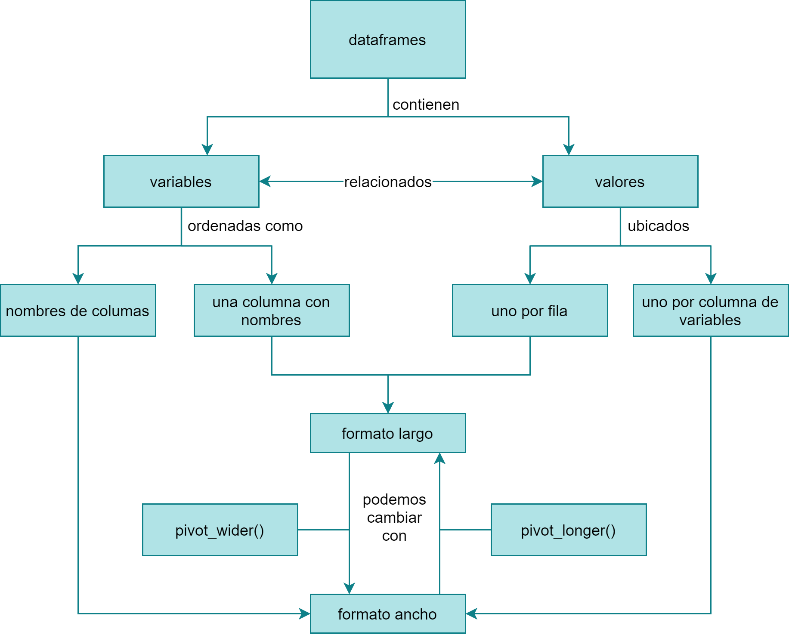
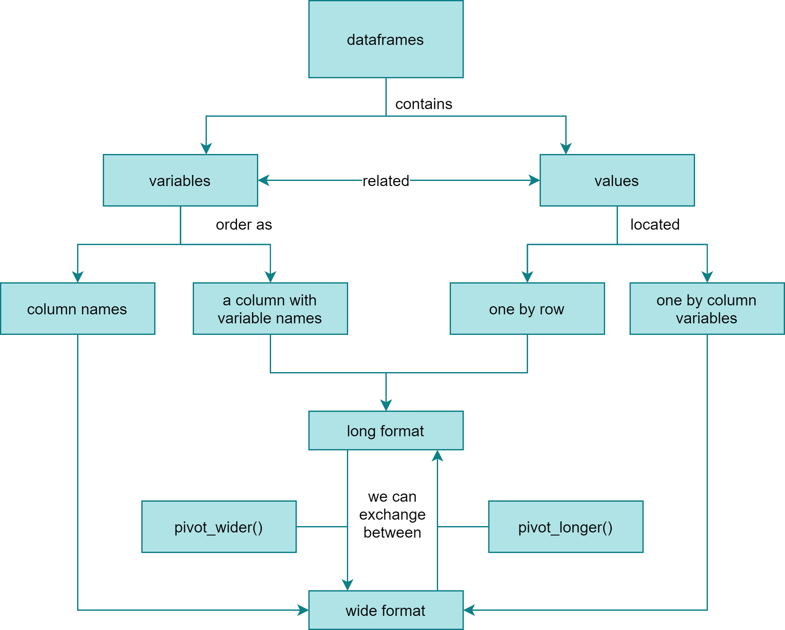

Teaching Exam
================
Stephanie Orellana Bello

  - [Español](#español)
      - [Contexto](#contexto)
      - [Descripción de estudiantes](#descripción-de-estudiantes)
      - [Concept map](#concept-map)
      - [Evaluación formativa](#evaluación-formativa)
          - [Pregunta 1](#pregunta-1)
          - [Pregunta 2](#pregunta-2)
      - [Paquetes necesarios para la
        clase](#paquetes-necesarios-para-la-clase)
      - [Enlaces](#enlaces)
  - [English](#english)
      - [Context](#context)
      - [Learner persona](#learner-persona)
      - [Concept map](#concept-map-1)
      - [Formative asessmet](#formative-asessmet)
          - [Question 1](#question-1)
          - [Question 2](#question-2)
      - [Packages needed for the class](#packages-needed-for-the-class)
      - [Links](#links)

# Español

## Contexto

Esta clase forma parte de un curso de verano optativo para estudiantes
de Agronomía e Ingeniería Forestal en una universidad en Chile. El curso
tiene una duración de una semana y se enfoca en aprender a realizar
análisis de datos de campo en R. Los tres primeros días se realiza una
introducción a R, Rstudio, la indexación de R base, las funciones
básicas de Tidyverse y el uso del operador pipe. Ahora es momento para
presentar aplicaciones prácticas de lo aprendido, lo primero será
aprender a usar las funciones pivot\_longer() y pivot\_wider() las
cuales permiten reodenar fácilmente los inventarios de terreno en una
base de datos y hacer la acción inversa.

## Descripción de estudiantes

Carla es estudiante de Agronomía y se encuentra en su último año. Ella
está preparando su tesis y ha trabajado como ayudante de investigación
en un laboratorio que realiza estudios de campo monitoreando fauna
nativa. Ella sabe usar muy bien Excel, pero se ha dado cuenta que luego
de volver de las campañas de terreno, pasa mucho tiempo reordenando la
información “a mano” para poder hacer gráficos y análisis. Ella ha
estado investigando y le han recomendado aprender a usar R, ha intentado
aprender por su cuenta y su conclusión es que R es complejo y que
demorará más en aprender R que en hacer las cosas “a mano”, ya que tiene
el proceso bastante mecanizado. Sin embargo, está dispuesta a darle una
nueva oportunidad a R tomando este curso de verano y espera aprender a
realizar consultas simples de sus datos, tablas resumen y gráficos.

Daniel está trabajando en su tesis estudiando las diferencias en
semillas de diferentes variedades de quinoa. Un investigador le ha
enseñado un poco de R y le ha entregado códigos que hacen todo lo
necesario para analizar los datos. Daniel está un poco preocupado porque
no entiende mucho de lo que está escrito, ha intentado buscar ayuda en
Internet pero encuentra información solamente en inglés (su nivel de
inglés es básico) y se siente muy confundido. Él no tiene un computador
personal, así que pasa muchas horas en la universidad para poder usar el
computador del laboratorio, así que también espera aprender a usar R ya
que sabe que programando puede hacer muchas labores de forma más
eficiente y de este modo podría tener más tiempo libre.

## Concept map



## Evaluación formativa

### Pregunta 1

El argumento `sep = "...."` sirve cuando tenemos nombres con variables
separadas por un caracter.

Rellena el siguiente código para obtener tres columnas a partir del
nombre de las columnas seleccionadas.

``` r
library(datos)
library(tidyr)

pivot_longer(
  data = pinguinos,
  cols = largo_pico_mm:masa_corporal_g,
  names_to = _________, # el estudiante debe reconocer que tiene que indicar tres nombres de columna
  ________ =  "valor",  # para recordar el argumento
  names_sep = _______   # debe poner el separador correcto
)
```

**Respuesta**

``` r
library(datos)
library(tidyr)

pivot_longer(
  data = pinguinos,
  cols = largo_pico_mm:masa_corporal_g,
  names_to = c("variable", "estructura", "unidad"), 
  values_to = "valor", 
  names_sep = "_"
)
```

### Pregunta 2

Teniendo la siguiente tabla:

    ## # A tibble: 12 x 3
    ## # Groups:   anio [3]
    ##     anio variable         media
    ##    <int> <chr>            <dbl>
    ##  1  2007 alto_pico_mm      17.4
    ##  2  2007 largo_aleta_mm   197. 
    ##  3  2007 largo_pico_mm     43.7
    ##  4  2007 masa_corporal_g 4125. 
    ##  5  2008 alto_pico_mm      16.9
    ##  6  2008 largo_aleta_mm   203. 
    ##  7  2008 largo_pico_mm     43.5
    ##  8  2008 masa_corporal_g 4267. 
    ##  9  2009 alto_pico_mm      17.1
    ## 10  2009 largo_aleta_mm   203. 
    ## 11  2009 largo_pico_mm     44.5
    ## 12  2009 masa_corporal_g 4210.

¿Puedes inferir el resultado de la función?

``` r
pivot_wider(media_anual, names_from = "anio", values_from = "media")
```

**Respuesta**

Será una tabla ancha con los años en columnas, la primera columna será
la variable y los valores promedio estarán en cada casilla.

## Paquetes necesarios para la clase

``` r
# Paquete tidyverse
install.packages("tidyverse")

# Versión de desarrollo del paquete datos
# 
# install.packages("remotes")
remotes::install_github("cienciadedatos/datos")
```

## Enlaces

Presentación: <https://sporella.github.io/pivot>

Código (disponible después de la clase):
<https://github.com/sporella/pivot/blob/master/code.R>

# English

## Context

This class is part of an elective summer course for Agronomy and Forest
Engineering students at a university in Chile. The course lasts one week
and focuses on learning how to perform field data analysis in R. The
first three days are an introduction to R, Rstudio, base R indexing,
basic Tidyverse functions, and usage of the pipe operator. Now is the
time to present practical applications of what has been learned, the
first thing is to learn to use the pivot\_longer () and pivot\_wider ()
functions which allow you to easily reorder the tables with field data
into long format and do the reverse action.

## Learner persona

Carla is a final year Agronomy student. She is preparing her thesis and
has worked as a research assistant in a laboratory conducting field
studies monitoring native fauna. She knows how to use Excel very well,
but has found that after returning from field campaigns, she spends a
lot of time rearranging the information “by hand” to be able to do
graphs and analysis. She has been researching and they have recommended
learning to use R, she has tried to learn on her own and her conclusion
is that R is complex and that it will take longer to learn R than to do
things “by hand”, since it has the process quite machining. However, she
is willing to give R another chance by taking this summer course and
hopes to learn how to perform simple queries on her data, summary
tables, and graphs.

Daniel is working on his thesis studying the differences in seeds of
different varieties of quinoa. A researcher has taught him a bit of R
and given him codes that do whatever it takes to analyze the data.
Daniel is a bit worried because he does not understand much of what is
written, he has tried to search for help on the Internet but finds
information only in English (his level of English is basic) and he feels
very confused. He does not have a personal computer, so he spends many
hours at the university to be able to use the computer in the
laboratory, so he also hopes to learn to use R since he knows that by
programming he can do many tasks more efficiently and thus could have
more free time.

## Concept map



## Formative asessmet

### Question 1

The argument `sep =" .... "` works when we have names with variables
separated by a character.

Fill in the following code to get three columns from the name of the
selected columns.

``` r
library(datos)
library(tidyr)

pivot_longer(
  data = pinguinos,
  cols = largo_pico_mm:masa_corporal_g,
  names_to = _________, # the student must recognize that he has to indicate three column names
  ________ =  "valor",  # to remember the argument
  names_sep = _______   # put the correct separator
)
```

**Respuesta**

``` r
library(datos)
library(tidyr)

pivot_longer(
  data = pinguinos,
  cols = largo_pico_mm:masa_corporal_g,
  names_to = c("variable", "estructura", "unidad"), 
  values_to = "valor", 
  names_sep = "_"
)
```

### Question 2

Having the following table:

    ## # A tibble: 12 x 3
    ## # Groups:   anio [3]
    ##     anio variable         media
    ##    <int> <chr>            <dbl>
    ##  1  2007 alto_pico_mm      17.4
    ##  2  2007 largo_aleta_mm   197. 
    ##  3  2007 largo_pico_mm     43.7
    ##  4  2007 masa_corporal_g 4125. 
    ##  5  2008 alto_pico_mm      16.9
    ##  6  2008 largo_aleta_mm   203. 
    ##  7  2008 largo_pico_mm     43.5
    ##  8  2008 masa_corporal_g 4267. 
    ##  9  2009 alto_pico_mm      17.1
    ## 10  2009 largo_aleta_mm   203. 
    ## 11  2009 largo_pico_mm     44.5
    ## 12  2009 masa_corporal_g 4210.

Can you infer the result of the function?

``` r
pivot_wider(media_anual, names_from = "anio", values_from = "media")
```

**Respuesta**

It will be a wide table with the years in columns, the first column will
be the variable and the average values will be in each box.

## Packages needed for the class

``` r
# Paquete tidyverse
install.packages("tidyverse")

# Development version of package "datos"
# 
# install.packages("remotes")
remotes::install_github("cienciadedatos/datos")
```

## Links

Slides: <https://sporella.github.io/pivot>

Live coding (available after class):
<https://github.com/sporella/pivot/blob/master/code.R>
